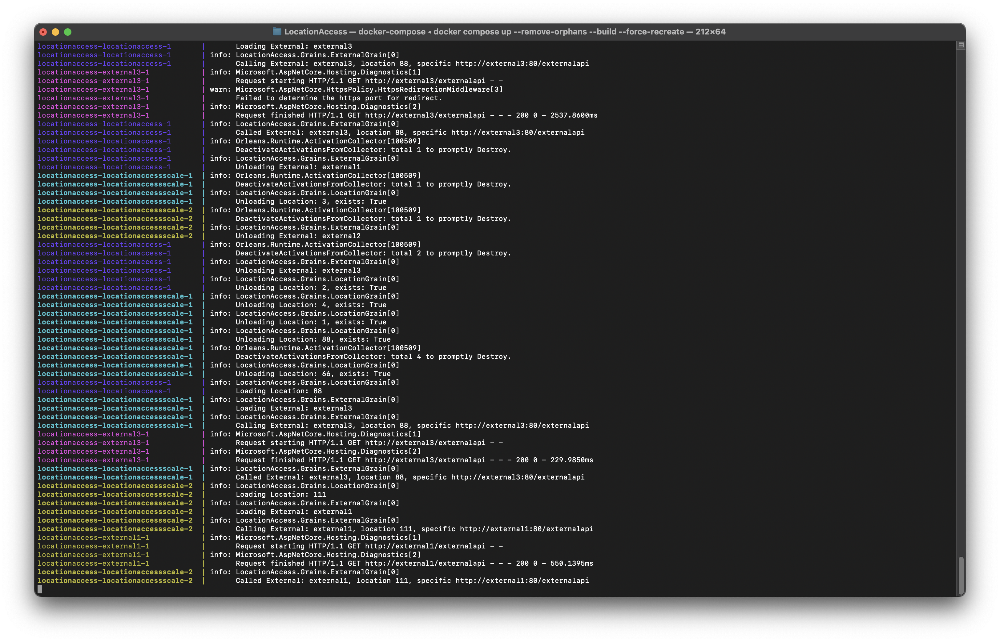

# OrleansClusterIdeas

## Getting started

1. Run docker-compose in `LocationAccess`
   ```
   docker compose up --remove-orphans --build --force-recreate
   ```
2. Open `http://127.0.0.1/swagger/index.html` for Swagger
3. Open redis-commander at `http://localhost:8081/` to see Orleans Silo cluster keys
4. Inspect and check that there are multiple instances of the .NET application running.
5. Attempt the call endpoint for whatever Ids you want. A number of low digit locations are initialized in the sqlite database. The point is to watch the logs and see these requests get distributed across the silo.
   ```
   curl -X 'GET' \
     'http://127.0.0.1/Locations/{locationId}/call' \
     -H 'accept: */*'
   ```
7. Stop, restart, or scale multiple instances from docker compose.  Keep running the above requests for random ids and see them get distributed across hosts. 
8. Wait a couple minutes without changing anything and see Grains start getting deactivated.

## Sample showing hosts



## Tools

* JetBrains Rider
* .NET 7
* Microsoft Orleans
* Docker
